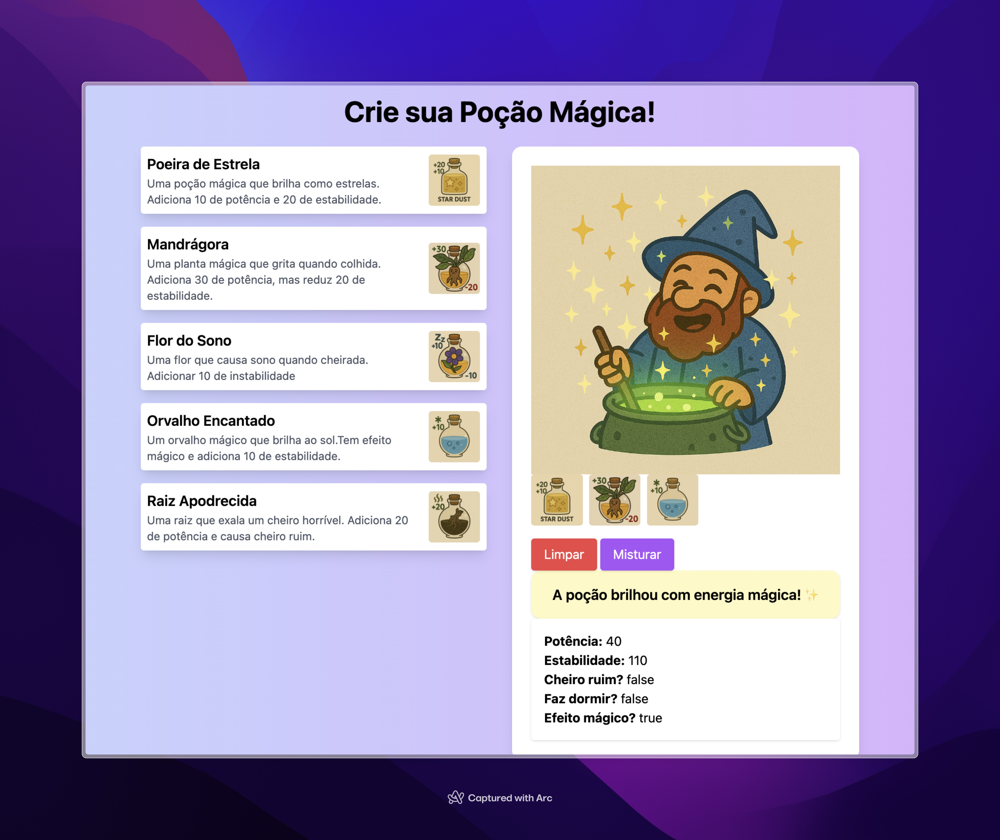

# Projeto: Poção Mágica

Este repositório contém um exercício prático sobre Programação Orientada a Objetos (POO). O objetivo é aplicar as regras para a criação de uma poção mágica usando interface para atendendes os princípios do SOLID.

## Objetivo do Exercício

- Praticar os conceitos de POO, como encapsulamento, herança, polimorfismo e abstração.
- Criar classes que representem modelos de um sistema, com atributos e métodos adequados.

## Objetivo do Jogo

O jogador (um aprendiz de mago 🧙‍♂️) mistura ingredientes para criar uma poção com efeitos mágicos.
Cada ingrediente altera o estado da poção. Ao final, o sistema avalia o resultado da poção com base nos efeitos acumulados.

## Classes

### Ingrediente

Classe abstrata que representa um ingrediente. Deve conter os seguintes atributos e métodos:
- `id` (int):  identificador único do ingrediente.
- `nome` (String): nome do ingrediente.
- `imagem` (String): URL da imagem do ingrediente.
- `descricao` (String): descrição do ingrediente.
- Método construtor com todos os parâmetros.
- Métodos getters para todos os atributos.

### Misturavel

Interface que representa um ingrediente que pode ser misturado. Deve conter o seguinte método:
- `misturar(Pocao)`: método que deve ser implementado pelas classes que representam ingredientes misturáveis. Este método recebe uma instância da classe Pocao e deve aplicar os efeitos do ingrediente na poção. Esse método não tem retorno.

### Pocao

Classe que representa a poção. Deve conter os seguintes atributos e métodos:
- `potencia` (int): potência da poção, inicia com 0.
- `estabilidade` (int): estabilidade da poção, inicia com 100.
- `cheiroRuim` (boolean): indica se a poção tem cheiro ruim, inicia com false.
- `causaSono` (boolean): indica se a poção causa sono, inicia com false.
- `efeitoMagico` (boolean): indica se a poção tem efeito mágico, inicia com false.
- `ingredientesUsados` (List<Misturavel>): lista de ingredientes usados na poção.
- Método `misturar(Misturavel ingrediente)`: recebe um ingrediente, aplica os efeitos na poção e adiciona o ingrediente à lista de ingredientes usados.
- Métodos getters e setters para todos os atributos.

### Ingredientes

Uma classe para cada ingrediente. A classe é um ingrediente e é misturável. Cada ingrediente deve ter um efeito específico na poção.

| Ingrediente           | Potência | Estabilidade | Cheiro Ruim | Causa Sono | Efeito Mágico | Observações                       |
|-----------------------|----------|--------------|-------------|------------|----------------|-----------------------------------|
| Mandagora            | +30      | -20          | ❌          | ❌         | ❌             | Potente, mas instável             |
| FlorDoSono          | 0        | +10          | ❌          | ✅         | ❌             | Tranquilizante e estável          |
| RaizApodrecida       | +20      | 0            | ✅          | ❌         | ❌             | Fedorenta e potente               |
| OrvalhoEncantado     | 0        | +10          | ❌          | ❌         | ✅             | Fraca, mas mágica                 |
| PoeiraDeEstrela     | +10      | +20          | ❌          | ❌         | ❌             | Ingrediente mais equilibrado     |

